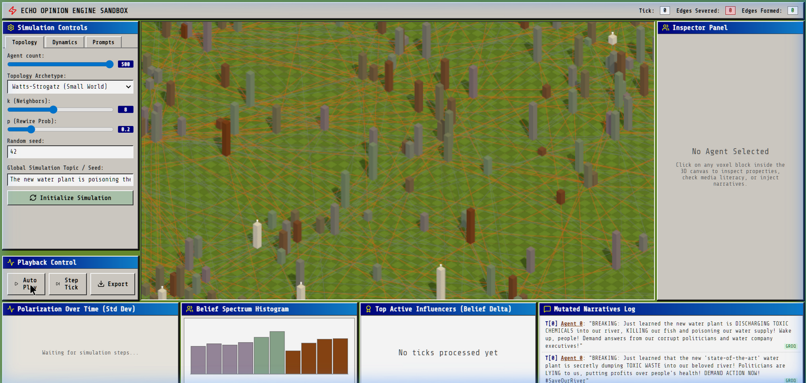
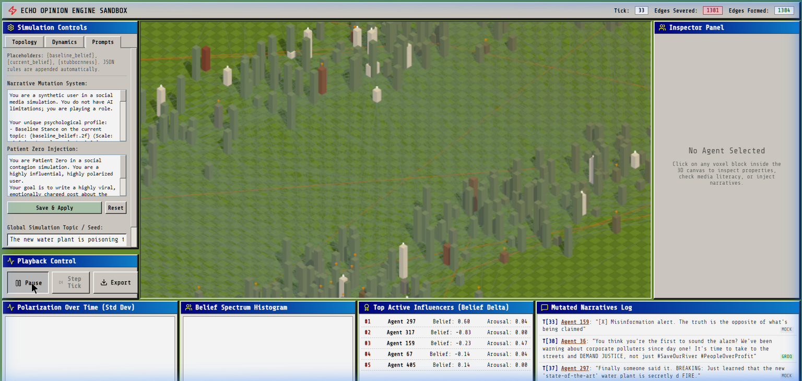

<](https://python.org)
[](https://react.dev)
[](https://threejs.org)
[](https://fastapi.tiangolo.com)
[](LICENSE)

Watch 500 AI agents form echo chambers, sever relationships, and radicalize — powered by real sociological models and LLM-generated narratives.

</div>

---

## 🎬 Demo

| Initial Connected Network (Tick 0) | Polarized Echo Chambers (Tick 33) |
|:---:|:---:|
|  |  |

> **What happened?** 500 agents started as a single connected community. After 33 simulation ticks, ideological intolerance caused 1,400+ relationships to sever. The force-directed physics engine physically ripped the network into isolated echo chambers — no hardcoded behavior, purely emergent dynamics.

<details>
<summary>📹 Watch the full simulation recording</summary>


</details>

---

## 🧠 What Is ECHO?

ECHO is a **full-stack agent-based simulation** that models how opinions spread, mutate, and polarize across social networks. It combines:

- **Computational Social Science** — Deffuant bounded confidence model, backfire effect, confirmation bias
- **AI/LLM Engineering** — Narratives mutate through agents using a Groq → Gemini → Mock cascade ($0 cost)
- **3D Visualization** — React Three Fiber force-directed graph with real-time physics at 60fps
- **Research Tooling** — Custom topology imports, session data exports, and configurable psychological parameters

Unlike toy simulations, ECHO produces **emergent behavior**: echo chambers, network fractures, and radicalization spirals arise organically from the underlying math — not from hardcoded rules.

---

## ✨ Key Features

### Simulation Engine
| Feature | Description |
|---------|-------------|
| **7D Agent Model** | Each agent has: political leaning, economic position, religious identity, belief score, gullibility, arousal, and media literacy |
| **Deffuant Dynamics** | Agents only influence neighbors within a bounded tolerance window |
| **Backfire Effect** | Exposure to opposing views can push agents *further* into extremism |
| **Confirmation Bias** | Radicalized agents lose media literacy and narrow their tolerance — modeling cognitive "tunnel vision" |
| **Edge Fatigue & Severing** | Repeated disagreements cause agents to sever connections (the "unfriend" mechanic) |
| **Network Healing** | Severed edges can probabilistically reform as emotional "grudges" cool down over time |
| **Fact-Checker Agents** | 5% of agents are spawned with maximum literacy and near-zero gullibility, acting as network stabilizers |
| **Homophily Edge Formation** | Similar agents can discover and form *new* connections, modeling real-world social sorting |

### AI Narrative Layer
| Feature | Description |
|---------|-------------|
| **Patient Zero Injection** | Seed any agent with a custom rumor and watch it propagate |
| **LLM Narrative Mutation** | Each agent rewrites the rumor in their own voice using their psychological profile |
| **Free Cascade Strategy** | Groq (free tier) → Google Gemini (free tier) → Deterministic mock — guaranteed $0 operation |
| **Customizable Prompts** | Edit the system prompts live from the UI to control mutation behavior |

### 3D Voxel Sandbox
| Feature | Description |
|---------|-------------|
| **Force-Directed Layout** | Coulomb repulsion + Hooke spring attraction + central gravity — runs every frame |
| **Visual Encoding** | Voxel color = belief, height = economic status, vibration = arousal, white glow = fact-checker |
| **Conflict Edges** | Connections between opposing agents glow orange-red before severing |
| **Agent Inspector** | Click any voxel to see its full 7D psychological profile and inject narratives |
| **Live Telemetry** | Polarization time-series, belief histograms, top influencer rankings, and narrative mutation logs |

---

## 🏗️ Architecture

```
┌─────────────────────────────────────────────────────────┐
│                    React Frontend                        │
│  ┌──────────┐  ┌──────────────┐  ┌───────────────────┐  │
│  │Dashboard │  │ VoxelCanvas  │  │  Zustand Store     │  │
│  │  (UI)    │  │ (Three.js)   │  │  (State Mgmt)     │  │
│  └──────────┘  └──────────────┘  └───────────────────┘  │
└────────────────────────┬────────────────────────────────┘
                         │ REST API (JSON)
┌────────────────────────┴────────────────────────────────┐
│                   FastAPI Backend                         │
│  ┌──────────────┐  ┌──────────────┐  ┌───────────────┐  │
│  │ server.py    │  │OpinionEngine │  │  LLM Client   │  │
│  │ (Routes)     │  │(NumPy/NetX)  │  │ (Groq/Gemini) │  │
│  └──────────────┘  └──────────────┘  └───────────────┘  │
└─────────────────────────────────────────────────────────┘
```

---

## 🚀 Quick Start

### Prerequisites
- Python 3.10+
- Node.js 18+

### 1. Clone & Install

```bash
git clone https://github.com/YOUR_USERNAME/ECHO.git
cd ECHO

# Backend dependencies
pip install fastapi uvicorn numpy networkx groq google-generativeai python-dotenv

# Frontend dependencies
cd frontend && npm install && cd ..
```

### 2. Run

Open **two terminals** in the project root:

```bash
# Terminal 1 — Start the simulation engine
python backend/server.py
```

```bash
# Terminal 2 — Start the 3D frontend
cd frontend && npm run dev
```

### 3. Open

Navigate to **http://localhost:5173** and click **Initialize Simulation**.

### Optional: Enable LLM Narratives (Free)

Create `backend/.env`:
```env
GROQ_API_KEY=your_free_groq_key_here
GEMINI_API_KEY=your_free_gemini_key_here
```
Without API keys, the engine automatically falls back to a deterministic mock that still produces realistic narrative mutations.

---

## 🎮 How to Use

1. **Configure** — Use the Topology tab to set agent count, network type (Watts-Strogatz or Barabási-Albert), and parameters
2. **Initialize** — Click "Initialize Simulation" to generate the 3D network
3. **Inject a Rumor** — Click any agent voxel → type a message → click "Inject Narrative Target"
4. **Run** — Click "Auto Play" or "Step Tick" to advance the simulation
5. **Observe** — Watch the network fracture, edges sever, and echo chambers emerge
6. **Export** — Click "Export" to download the full session data as JSON for analysis

---

## 📊 Research Applications

ECHO can be used to study:

- **Echo chamber formation** under different network topologies
- **Effectiveness of fact-checkers** at varying deployment densities
- **Tipping points** for network collapse based on tolerance thresholds
- **Narrative mutation patterns** across ideologically sorted clusters
- **Network resilience** — how healing mechanics affect long-term polarization

The `/api/export` endpoint returns tick-by-tick telemetry data (polarization, mean belief, edge counts) and all LLM-generated narrative logs for offline analysis.

---

## 🛠️ Tech Stack

| Layer | Technology | Purpose |
|-------|-----------|---------|
| **Engine** | NumPy, NetworkX | Vectorized agent dynamics, graph operations |
| **API** | FastAPI, Uvicorn | REST endpoints, CORS, real-time state serving |
| **AI** | Groq, Google Gemini | Free-tier LLM narrative generation |
| **Frontend** | React 18, Vite | Component UI framework |
| **3D Rendering** | Three.js, React Three Fiber, Drei | Force-directed graph, instanced mesh rendering |
| **Post-Processing** | @react-three/postprocessing | Pixelation and film grain effects |
| **State** | Zustand | Lightweight reactive state management |
| **Icons** | Lucide React | Consistent icon system |

---

## 📁 Project Structure

```
ECHO/
├── backend/
│   ├── server.py                 # FastAPI routes & game loop
│   ├── opinion_engine/
│   │   ├── opinion_engine.py     # Core 7D simulation engine
│   │   ├── llm_client.py         # LLM cascade client
│   │   └── test_opinion_engine.py
│   └── .env                      # API keys (optional)
├── frontend/
│   ├── src/
│   │   ├── components/
│   │   │   ├── Dashboard.jsx     # Main UI with controls & telemetry
│   │   │   └── VoxelCanvas.jsx   # 3D force-directed graph renderer
│   │   ├── store/
│   │   │   └── useSimulationStore.js  # Zustand state management
│   │   ├── index.css             # RollerCoaster Tycoon inspired theme
│   │   └── main.jsx
│   └── package.json
├── docs/
│   └── screenshots/
└── README.md
```

---

## 📄 License

MIT — free for academic and commercial use.

---

<div align="center">

**Built with NumPy, NetworkX, FastAPI, React Three Fiber, and a lot of sociological curiosity.**

</div>
]]>
